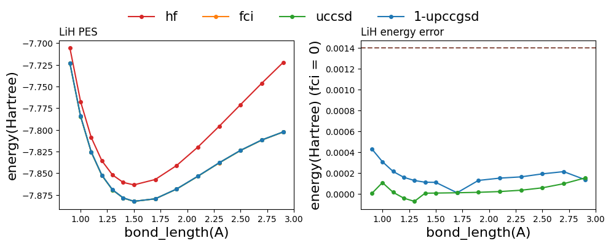
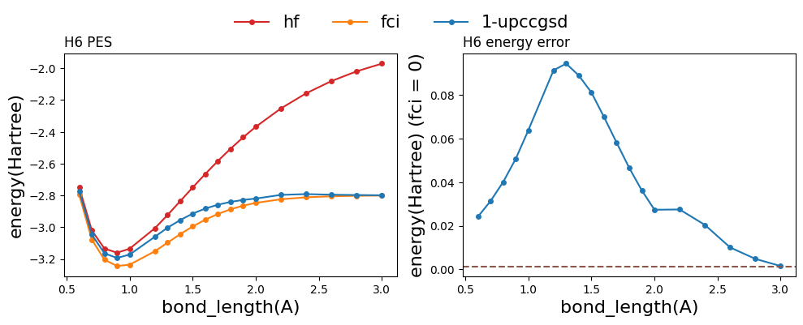

- [projectq Benchmark Results](#projectq-benchmark-results)
  - [Module Info](#module-info)
  - [Hardware Platform](#hardware-platform)
  - [LiH molecule](#lih-molecule)
    - [Settings](#settings)
    - [Result](#result)
  - [H6 chain](#h6-chain)
    - [Settings](#settings-1)
    - [Result](#result-1)
  - [BeH2 molecule](#beh2-molecule)
    - [Settings](#settings-2)
    - [Result](#result-2)
  - [H2O molecule](#h2o-molecule)
    - [Settings](#settings-3)
    - [Result](#result-3)
  - [N2 molecule](#n2-molecule)
    - [Settings](#settings-4)
    - [Result](#result-4)
- [Contributor](#contributor)

# projectq Benchmark Results
The performance of different algorithms in projectq for different molecules

## Module Info
| Module |    Name    |   WebPage |
|:-------:|:-------:|:-------------:|
| Molecule Modeling | PySCF | https://github.com/pyscf/pyscf |
| Quantum simulator |   projectq  | https://github.com/ProjectQ-Framework/ProjectQ |
| VQE algorithm | openfermion | https://github.com/quantumlib/OpenFermion |

## Hardware Platform
```
HUAWEI server
Taiyi HPC
```

## LiH molecule
### Settings
```
 Basis: STO-3G
 Transformation:Jordan-Wigner
 Qubit number: 12
```

### Result

Some data is not accurate.


## H6 chain
### Settings
```
 Basis: STO-3G
 Transformation:Jordan-Wigner
 Qubit number: 12
```

### Result

Some data is not accurate.


## BeH2 molecule
### Settings
```
 Basis: STO-3G
 Transformation:Jordan-Wigner
 Qubit number: 14
```

### Result

## H2O molecule
### Settings
```
 Basis: STO-3G
 Transformation:Jordan-Wigner
 Qubit number: 14
```

### Result

## N2 molecule
### Settings
```
 Basis: STO-3G
 Transformation:Jordan-Wigner
 Qubit number: 20
```

### Result

# Contributor
Benchmark and Document writing: Jiaqi Hu 
