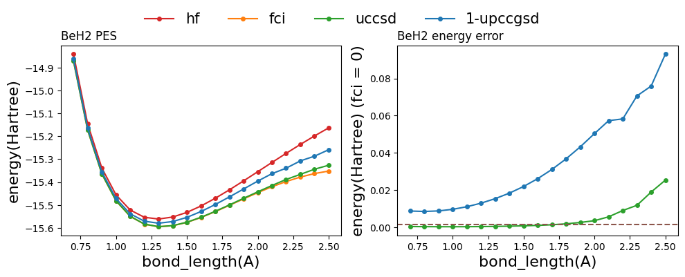

- [Qulacs Benchmark Results](#qulacs-benchmark-results)
  - [Module Info](#module-info)
  - [Hardware Platform](#hardware-platform)
  - [LiH molecule](#lih-molecule)
    - [Settings](#settings)
    - [Result](#result)
  - [BeH2 molecule](#beh2-molecule)
    - [Settings](#settings-1)
    - [Result](#result-1)
  - [H2O molecule](#h2o-molecule)
    - [Settings](#settings-2)
    - [Result](#result-2)
  - [N2 molecule](#n2-molecule)
    - [Settings](#settings-3)
    - [Result](#result-3)
- [Contributor](#contributor)

# Qulacs Benchmark Results
The performance of different algorithms in Qulacs for different molecules

## Module Info
| Module |    Name    |   WebPage |
|:-------:|:-------:|:-------------:|
| Molecule Modeling | PySCF | https://github.com/pyscf/pyscf |
| Quantum simulator |   qulacs  |    https://github.com/qulacs/qulacs    |
| VQE algorithm | Tequila | https://github.com/aspuru-guzik-group/tequila |

## Hardware Platform
```
HUAWEI server
Taiyi HPC
```

## LiH molecule
### Settings
```
 Basis: STO-3G
 Transformation:Jordan-Wigner
 Qubit number: 12
```

### Result


## BeH2 molecule
### Settings
```
 Basis: STO-3G
 Transformation:Jordan-Wigner
 Qubit number: 14
```

### Result


## H2O molecule
### Settings
```
 Basis: STO-3G
 Transformation:Jordan-Wigner
 Qubit number: 14
```

### Result

## N2 molecule
### Settings
```
 Basis: STO-3G
 Transformation:Jordan-Wigner
 Qubit number: 20
```

### Result

# Contributor
Benchmark and Document writing: Jiaqi Hu 
